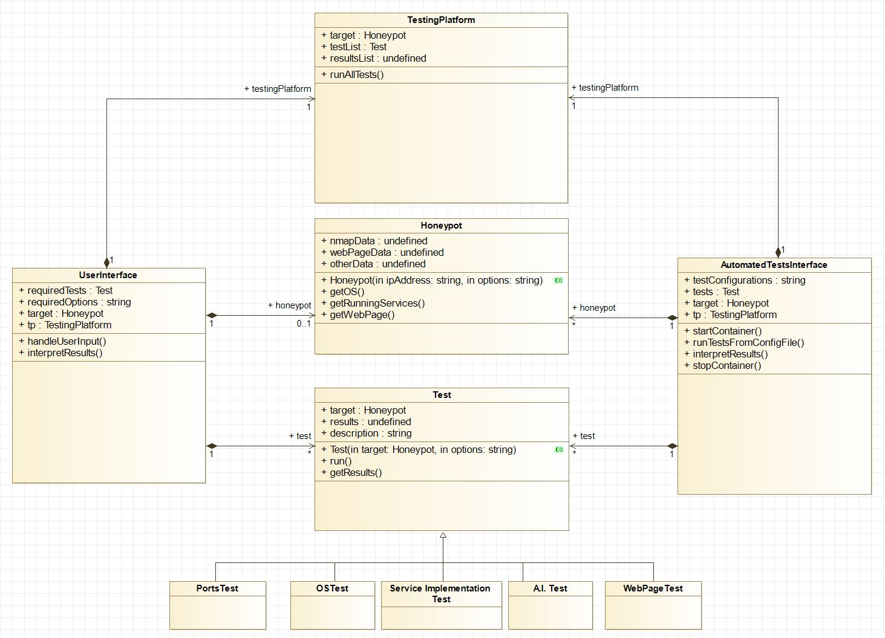

Tests and the TestPlatform framework
====================================

UML Diagram:
------------

High-Level Description:
-----------------------

The entire testing framework is based on the Strategy design pattern (https://en.wikipedia.org/wiki/Strategy_pattern).

All tests must extend from the :class:`~tests.test.Test` interface. This way they all respect the same structure, provide results according to a certain pattern, have a description, have a name, etc. Their :meth:`~tests.test.Test.run()` method, however, can be implemented how the test's author decides. This is where the Strategy pattern comes in, interfacing/connecting all different implementations to a common, easy to understand, framework.

In order to run :mod:`tests`, a :class:`~tests.test_platform.TestPlatform` instance is needed. The :class:`~tests.test_platform.TestPlatform` takes in a list of :mod:`tests`, does all initializations, runs the :mod:`tests` (calls their :meth:`~tests.test.Test.run()` methods) and provides the results and stats. This is possible because all :mod:`tests` must implement the same interface and thus all have the behavior expected by the :class:`~tests.test_platform.TestPlatform`.

:mod:`Tests<tests>` are very modular. All you must do to run a series of :mod:`tests` is to instantiate them and provide them along with the target Honeypot to a :class:`~tests.test_platform.TestPlatform` instance. Adding new :mod:`tests` will thus be very easy as the framework is already implemented and you only need to override the :meth:`~tests.test.Test.run()` method and enroll the :class:`~tests.test.Test` in the list provided to the :class:`~tests.test_platform.TestPlatform`.

The :class:`~honeypots.honeypot.Honeypot` class is the source of all data associated with a target: IP address, open ports, website, banners, etc. This way there can be no data dependency between :mod:`tests`. For example, there can be many :class:`~tests.test.Test` classes that need the website of the target system. The first :class:`~tests.test.Test` requests this data from the :class:`~honeypots.honeypot.Honeypot` class through the self.target_honeypot reference. The :class:`~honeypots.honeypot.Honeypot` class then fetches and caches the website. Afterward, it offers the cached version to all :mod:`tests` who request it in the future.

The :class:`~honeypots.honeypot.Honeypot` class is also meant to provide a common interface for gathering data, hiding the underlying implementation details. This way, if some of the libraries/algorithms used for fetching this data need to be changed, all modifications will happen exclusively inside the :class:`~honeypots.honeypot.Honeypot` class without affecting the :mod:`tests`.
